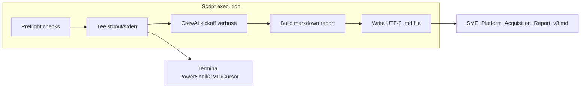

# Baseline.py Dual Output and Cross-Terminal Hardening

## Current state

[Baseline.py](c:\Users\remyg\Projects\Aquisition Helper\Baseline.py) runs a CrewAI swarm with `verbose=True` (terminal only) and writes the kickoff result to `SME_Platform_Acquisition_Report_v3.md` in the **current working directory**:

```209:216:c:\Users\remyg\Projects\Aquisition Helper\Baseline.py
if __name__ == "__main__":
    pipeline = SwarmAcquisitionArchitecture()
    final_report = pipeline.run()
    
    with open("SME_Platform_Acquisition_Report_v3.md", "w") as f:
        f.write(final_report)
    
    print("Report generation complete.")
```

**Gaps identified:**
- Only the final `CrewOutput` is saved; verbose agent/crew logs are lost from the `.md` file
- `CrewOutput` is written implicitly via `__str__` (works today, but fragile); structured per-task outputs (`tasks_output`) are not included
- No `encoding="utf-8"` on file write; output path depends on cwd (running from different folders changes where the file lands)
- No preflight check for `GEMINI_API_KEY` (fails late with an opaque LLM error)
- `sys.stdout.reconfigure(encoding="utf-8")` is unconditional (can throw if stdout is not reconfigurable)
- No top-level error handling or exit codes for terminal/CI use

CrewAI 1.2.0 is installed locally; `kickoff()` returns `CrewOutput` with fields: `raw`, `tasks_output`, `token_usage`.

## Target behavior



**Terminal:** unchanged live verbose output (colors preserved).

**Markdown file (your preference):** three sections in one clean document:
1. **Metadata** — timestamp, Python version, script path
2. **Execution log** — full captured stdout/stderr (ANSI stripped for readability)
3. **Structured results** — final report (`crew_output.raw`) plus per-task blocks from `crew_output.tasks_output` (task name, description, output)
4. **Token usage** — brief footer from `crew_output.token_usage` if present

## Implementation (single file: [Baseline.py](c:\Users\remyg\Projects\Aquisition Helper\Baseline.py))

### 1. Add small output utilities at top of file

Keep helpers inline (no new modules) to match the minimal-scope rule:

| Helper | Purpose |
|--------|---------|
| `configure_console_encoding()` | Try `sys.stdout/stderr.reconfigure(encoding="utf-8")`; no-op on failure |
| `TeeWriter` | Wraps a stream; forwards writes to terminal and an in-memory buffer |
| `capture_console()` | Context manager swapping `sys.stdout`/`sys.stderr` with `TeeWriter` instances |
| `strip_ansi(text)` | Remove terminal color codes from log text destined for `.md` |
| `validate_environment()` | Fail fast if `GEMINI_API_KEY` is missing; optional `python-dotenv` load from `.env` if present |
| `build_markdown_report(log_text, crew_output)` | Assemble the structured `.md` document |
| `write_report(path, content)` | Write with `encoding="utf-8"`, `newline="\n"` |

### 2. Refactor entry point into `main() -> int`

```python
def main() -> int:
    log_buffer: list[str] = []
    crew_output = None
    report_path = Path(__file__).resolve().parent / "SME_Platform_Acquisition_Report_v3.md"

    try:
        configure_console_encoding()
        validate_environment()
        with capture_console(log_buffer):
            pipeline = SwarmAcquisitionArchitecture()
            crew_output = pipeline.run()
        markdown = build_markdown_report("".join(log_buffer), crew_output)
        write_report(report_path, markdown)
        print(f"Report generation complete. Saved to: {report_path}")
        return 0
    except KeyboardInterrupt:
        # still write partial log if anything was captured
        ...
        return 130
    except Exception as error:
        # write error section into .md if log_buffer has content
        ...
        return 1

if __name__ == "__main__":
    sys.exit(main())
```

Key details:
- Output file always lands next to the script (`Path(__file__).resolve().parent`), so `python Baseline.py` from any cwd behaves the same in PowerShell, CMD, and Cursor terminal
- On failure/interrupt, write a partial `.md` with whatever was captured plus an error section (so long CrewAI runs are not lost)
- Use `crew_output.raw` explicitly for the final report; fall back to last `tasks_output[-1].raw` if `raw` is empty

### 3. Minor cleanup in existing class

- Fix inconsistent indentation on the Phase 3 comment block (line 133)
- Change `run()` return type hint to document `CrewOutput` (import from `crewai.crews.crew_output`)

### 4. Add [requirements.txt](c:\Users\remyg\Projects\Aquisition Helper\requirements.txt)

Pin the working environment for reproducible installs:

```
crewai>=1.2.0
python-dotenv>=1.0.0
```

(`python-dotenv` is optional at runtime but prevents the most common Windows failure: API key only in `.env`.)

## Example markdown structure

```markdown
# SME Platform Acquisition Report

**Generated:** 2026-06-15 14:30:00 UTC  
**Script:** C:\Users\remyg\Projects\Aquisition Helper\Baseline.py

---

## Execution Log

(captured verbose CrewAI output, ANSI stripped)

---

## Final Report

(crew_output.raw)

---

## Task Outputs

### Task: ...
**Description:** ...
**Output:**
...

---

## Token Usage

(summary)
```

## Verification (post-implementation)

Run these without invoking the full LLM swarm (no API cost):

1. `python -m py_compile Baseline.py` — syntax check
2. Small inline test of `build_markdown_report()` with a mock `CrewOutput` and sample log text containing ANSI codes — confirm `.md` is clean and sections render correctly
3. Smoke test `TeeWriter` — confirm `print()` appears on terminal and lands in buffer

Optional full integration test (requires `GEMINI_API_KEY`):

4. `python Baseline.py` from PowerShell, CMD, and Cursor terminal — confirm live verbose output, completion message with absolute path, and `.md` file created beside the script with all three sections populated

## Files changed

| File | Change |
|------|--------|
| [Baseline.py](c:\Users\remyg\Projects\Aquisition Helper\Baseline.py) | Tee capture, markdown builder, `main()` entry point, encoding/error hardening |
| [requirements.txt](c:\Users\remyg\Projects\Aquisition Helper\requirements.txt) | New — dependency pinning |

No other files required.
