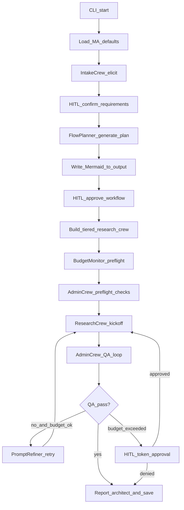
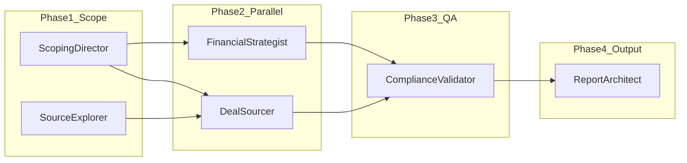

# Acquisition Helper — Full CrewAI Refactor Plan

## Current state

[`Baseline.py`](c:\Users\remyg\Projects\Aquisition Helper\Baseline.py) is a 496-line monolith: 11 inline `Agent`/`Task` definitions, one `Crew(process=Process.sequential)`, no Flow, no tools (despite `SERPER_API_KEY` in `.env`), hardcoded M&A strategic intent, and no user input. It works as a batch CLI but does not follow [CrewAI's recommended architecture](https://docs.crewai.com/en/introduction): **Flow as backbone, Crews as specialized teams**, YAML config, `@CrewBase`, tools, structured outputs, and HITL.

Your choices: **CLI + Mermaid** for intake/approval, **M&A/SME acquisition default** with per-run user edits.

---

## Part A — Cursor dev infrastructure (inspired by Scraper_Intel)

Scraper_Intel separates **Cursor dev agents** (safe, scoped code changes) from **runtime agents** (in-browser pipeline). Acquisition Helper already has runtime agents via CrewAI; the gap is dev-agent governance.

### A1. [`AGENTS.md`](AGENTS.md) — central registry

Dual registry modeled on [`Scraper_Intel/AGENTS.md`](c:\Users\remyg\Projects\Scraper_Intel\Scraper_Intel\AGENTS.md):

| Section | Contents |
|---------|----------|
| Skill resolution order | `skills-cursor` → `~/.agents/skills` → `.cursor/skills` |
| Cursor dev agents | Supervisor, FlowAuthor, CrewAuthor, ControlLayer, ToolsAuthor, Verification, Guardian, etc. |
| Runtime production agents | Flow steps + tiered research crew + admin crew |
| Supervisor routing table | e.g. "change agent tier" → ControlLayer → Verification |
| Known failures | Missing `GEMINI_API_KEY`, partial runs on interrupt, token threshold exceeded |

### A2. Cursor rules (`.cursor/rules/`)

| Rule | Scope | Purpose |
|------|-------|---------|
| `project-rules.mdc` | **alwaysApply** | Python/CrewAI stack contract: `pyproject.toml`, `crewai run`, `.env` never committed, Pydantic outputs, typed errors, minimal scope |
| `agent-safety.mdc` | `src/**/*.py` | No hardcoded secrets; `EnvironmentError` for missing keys; no empty `except` |
| `crew-orchestration.mdc` | on demand | Supervisor routes; one skill per subtask; mandatory verification after `flow/` or `crews/` edits |
| `layer-routing.mdc` | on demand | `flow/` vs `crews/` vs `control/` vs `tools/` vs `reporting/` — no cross-layer drive-by edits |
| `hitl-checkpoints.mdc` | on demand | Dev HITL: changing tier matrix, LLM model, strategic intent defaults, token ceilings |
| `verification-gate.mdc` | on demand | Evidence before claiming done (`crewai test`, dry-run, compile) |
| `learnings.mdc` | on demand | Append recurring patterns to `docs/learnings.md` |

### A3. Project skills (`.cursor/skills/`)

| Skill | Maps to |
|-------|---------|
| `crew-orchestration` | SupervisorAgent — routes only, never edits |
| `acquisition-flow` | `src/acquisition_helper/flow/` |
| `m-and-a-research` | Research crew YAML + tier definitions |
| `control-layer` | `src/acquisition_helper/control/` (budget, HITL, planner) |
| `crew-tools` | Serper/Firecrawl tool wiring |
| `proactive-guardian` | Pre-change risk scan (token blow-up, missing tools, YAML/agent mismatch) |
| `pattern-error-learning` | Post-fix → `docs/learnings.md` |

Reuse user-level skills where possible: `systematic-debugging`, `verification-before-completion`, `security-best-practices`.

### A4. Safety hooks

| File | Purpose |
|------|---------|
| [`.cursor/hooks.json`](.cursor/hooks.json) | `afterFileEdit` → validate Python |
| [`scripts/hooks/validate-crew-safety.py`](scripts/hooks/validate-crew-safety.py) | Scan for API key patterns, empty catches in `src/` |

### A5. Repo hygiene (missing today)

- [`.gitignore`](.gitignore) — exclude `.env`, `output/`, `__pycache__`, `.venv`
- [`.env.example`](.env.example) — `GEMINI_API_KEY`, `SERPER_API_KEY`, `TOKEN_BUDGET`, `CONTROL_PROFILE`
- [`README.md`](README.md) — install, `crewai run`, tier profiles, HITL flow

---

## Part B — Target CrewAI project structure

Scaffold with `crewai create flow acquisition_helper` then reshape:

```
acquisition_helper/
├── pyproject.toml
├── README.md
├── .env.example
├── src/acquisition_helper/
│   ├── main.py                      # CLI: intake → plan → approve → kickoff
│   ├── flow/
│   │   └── acquisition_flow.py      # @Flow master orchestrator + persisted state
│   ├── crews/
│   │   ├── intake_crew/             # Elicit & normalize user requirements
│   │   ├── research_crew/           # Tiered M&A research (core output)
│   │   └── admin_crew/              # Supervisory/admin agents (non-output)
│   ├── control/                     # Python control layer (Scraper_Intel port)
│   │   ├── agent_registry.py
│   │   ├── budget_monitor.py
│   │   ├── flow_planner.py
│   │   ├── hitl.py
│   │   ├── profiles.py              # conservative | standard | aggressive
│   │   └── guardrails.py
│   ├── models/
│   │   ├── intake.py                # UserRequirements, StrategicIntent
│   │   ├── workflow_plan.py         # AgentGraph, TierSpec
│   │   └── report.py                # Structured report sections
│   ├── tools/
│   │   ├── serper_tool.py           # Wire existing SERPER_API_KEY
│   │   └── registry.py
│   ├── config/
│   │   ├── agents/                  # agents_tier_essential.yaml … agents_tier_expert.yaml
│   │   ├── tasks/
│   │   ├── admin_agents.yaml
│   │   └── defaults.yaml            # M&A SME platform default intent
│   └── reporting/
│       └── markdown_report.py       # Migrate from Baseline.py (TeeWriter, build_markdown_report)
├── knowledge/                       # Optional: M&A playbooks, sector primers
├── output/                          # Reports + flow diagrams
└── tests/
    ├── test_flow_planner.py
    ├── test_tier_selection.py
    └── test_budget_monitor.py
```

[`Baseline.py`](c:\Users\remyg\Projects\Aquisition Helper\Baseline.py) becomes a thin compatibility shim (`python Baseline.py` → `crewai run`) during migration, then deprecated.

---

## Part C — Runtime architecture

Per [CrewAI docs](https://docs.crewai.com/en/introduction): **Flow manages state and control; Crews do autonomous work.**



### Flow state (`acquisition_flow.py`)

Use [`@persist`](https://docs.crewai.com/en/guides/flows/mastering-flow-state) + Pydantic state model:

- `user_requirements` — sector, geography, revenue/EBITDA bands, deal thesis (editable M&A defaults)
- `strategic_intent` — derived from intake + defaults
- `tier` — `essential | standard | advanced | expert`
- `workflow_plan` — selected agents, task DAG, estimated token range
- `approval_status` — requirements_approved, workflow_approved, budget_approved
- `crew_outputs` — per-phase results
- `token_usage` — running totals

HITL via [`@human_feedback`](https://docs.crewai.com/en/learn/human-feedback-in-flows) on Flow steps (CLI prompts: approve / edit / cancel).

---

## Part D — Tiered agent complexity (requirement 2)

More agents = narrower specialization, richer `context` chains, more QA loops, and stronger tools per agent.

| Tier | Active production agents | Approx. count | Accuracy lever |
|------|--------------------------|---------------|----------------|
| **Essential** | Scoping Director → Integrated Research Analyst (merged profiler+finance+sourcer) → Report Architect | **3** | Fast executive brief; single synthesis pass |
| **Standard** | Essential + Explorer + Deal Sourcer + Financial Strategist + Compliance Validator | **7** | Separate sourcing vs modeling; validation gate |
| **Advanced** | Standard + Tech Architect + Workforce Analyst + Risk Assessor | **10** | Parallel deep-dive on tech/workforce/risk |
| **Expert** | Full current lineup: all 11 Baseline agents + parallel Phase 2 | **11** | Red team + full context chain (current Baseline fidelity) |

Implementation:

- [`config/agents/agents_tier_*.yaml`](src/acquisition_helper/config/agents/) — agent definitions with `{strategic_intent}`, `{sector}`, etc.
- [`control/agent_registry.py`](src/acquisition_helper/control/agent_registry.py) — maps tier → agent IDs + task DAG (ported from Scraper_Intel's registry pattern)
- [`flow_planner.py`](src/acquisition_helper/control/flow_planner.py) — builds plan from tier + user requirements; emits Mermaid

CLI flags: `--tier essential|standard|advanced|expert` and interactive picker during intake.

**Model routing by tier** (cost vs precision): Essential uses flash-lite throughout; Expert upgrades validator/red-team/report to a stronger model (configurable in `defaults.yaml`).

---

## Part E — Admin agents (requirement 3)

Admin agents do **not** produce the final M&A report directly; they supervise quality, cost, and workflow integrity. Grouped by function:

### Orchestration and planning

| Admin agent | Role |
|-------------|------|
| **WorkflowOrchestrator** | Flow-level supervisor; decides phase transitions, retries, early exit |
| **IntakeAnalyst** | Normalizes free-text user input into structured `UserRequirements` |
| **FlowPlanner** | Selects tier, agents, task DAG; generates Mermaid diagram |
| **CheckpointManager** | Persists/resumes state ([checkpointing](https://docs.crewai.com/en/concepts/checkpointing)) |

### Quality and accuracy

| Admin agent | Role |
|-------------|------|
| **ComplianceValidator** | Audits outputs vs strategic intent (migrate from Baseline) |
| **RedTeamTester** | Devil's advocate stress test (migrate from Baseline) |
| **CriticSupervisor** | Scorer + pass/fail; triggers rework loop (Scraper_Intel `critic.js` pattern) |
| **HallucinationGuard** | Flags unsourced claims; cross-checks tool results |
| **SchemaEnforcer** | Validates Pydantic task outputs before downstream context |
| **ContextCurator** | Summarizes/prunes upstream context to reduce drift and token waste |

### Prompt and model governance

| Admin agent | Role |
|-------------|------|
| **PromptRefiner** | Rewrites downstream task prompts based on upstream gaps |
| **ModelRouter** | Assigns LLM per agent/tier (lite vs pro) |
| **PlanningAgent** | Optional CrewAI [`planning=True`](https://docs.crewai.com/en/concepts/planning) for Expert tier |

### Cost, safety, observability

| Admin agent | Role |
|-------------|------|
| **BudgetMonitor** | Tracks tokens; estimates next phase cost; triggers HITL at threshold |
| **GuardrailsEngine** | PII/secret scan on inputs/outputs |
| **TraceLogger** | Structured execution log (extends current `TeeWriter` pattern) |
| **HumanFeedbackRouter** | Surfaces `@human_feedback` prompts at defined gates |

Admin agents live primarily in **`admin_crew/`** and **`control/`** Python modules. Production agents in **`research_crew/`** remain focused on M&A deliverables.

**Control profiles** (from Scraper_Intel): `conservative` (lower token ceiling, more HITL gates), `standard`, `aggressive` (higher ceiling, fewer interrupts).

---

## Part F — User intake and visual flow (requirement 4)

### CLI wizard (`main.py`)

Interactive steps (with defaults from [`config/defaults.yaml`](src/acquisition_helper/config/defaults.yaml)):

1. Confirm or edit strategic intent (current Baseline text as default)
2. Sector, geography, financial constraints, candidate count
3. Select tier (Essential → Expert) with cost/accuracy summary
4. Select control profile
5. **Review requirements** → HITL approve/edit/cancel

### Flow visualization

After intake, **FlowPlanner** writes:

- `output/workflow_plan.mmd` — Mermaid source
- `output/workflow_plan.md` — rendered diagram + agent table + estimated tokens

CLI prints the Mermaid block and path; user approves before `kickoff`.

Example Mermaid shape (tier: Standard):



User can **edit requirements** and **re-generate** the diagram without running the full crew.

---

## Part G — Requirement 1: review, amend, modify purpose

Mechanisms:

| Mechanism | How |
|-----------|-----|
| Per-run edits | CLI intake overrides `defaults.yaml` |
| Persistent templates | Save/load intent profiles to `config/profiles/*.yaml` (future; stub skill gated) |
| Mid-run amend | Flow checkpoint + resume; re-plan from failed QA step |
| Dev-time amend | Edit YAML agents/tasks without touching Python (`@CrewBase` reads config) |
| Full domain pivot | Still M&A-focused per your choice; user edits thesis/sector/constraints, not arbitrary domains |

---

## Part H — Best-in-class CrewAI improvements (requirement 5)

| Improvement | Rationale |
|-------------|-----------|
| **Flow + multi-Crew** | [Recommended production pattern](https://docs.crewai.com/en/concepts/production-architecture) |
| **YAML + `@CrewBase`** | [First crew guide](https://docs.crewai.com/en/guides/crews/first-crew) — config without code changes |
| **Tools: SerperDevTool** | Activate dormant `SERPER_API_KEY`; assign to Explorer + Sourcer |
| **Pydantic `output_json` / `output_pydantic`** on tasks | Structured intermediate artifacts, not free-form only |
| **`crewai test` + evals** | [Testing concept](https://docs.crewai.com/en/concepts/testing) for tier regression |
| **Checkpointing + replay** | Resume after interrupt (improve on current partial-report behavior) |
| **Event listeners** | Token usage, phase complete → BudgetMonitor |
| **Knowledge base** | `knowledge/` for M&A methodology docs |
| **`crewaiinc/skills`** | Install official CrewAI coding agent skills: `npx skills add crewaiinc/skills` |
| **Observability** | OpenTelemetry-ready logging; optional CrewAI tracing later |
| **Hierarchical process** (Expert tier) | [Custom manager agent](https://docs.crewai.com/en/learn/custom-manager-agent) for Phase 3 delegation |

Preserve proven pieces from Baseline: UTF-8 console, `TeeWriter`, markdown report assembly, graceful interrupt handling.

---

## Part I — Suggested adjustments to requirements 1–4

| Your requirement | Adjustment |
|------------------|------------|
| **1 — Amend purpose** | Add **saved M&A profiles** (e.g. "SME platform", "roll-up") as YAML presets — faster than retyping, still editable per run |
| **2 — Min/max agents** | Define min = **3** (Essential), max = **11 production + admin**; admin agents are always on but lightweight in Essential tier |
| **3 — Admin agents** | Run admin as **Flow Python steps + small AdminCrew**, not all as full LLM agents in Essential tier (keeps min tier fast/cheap) |
| **4 — Visual flow** | Mermaid in markdown is correct for CLI; add **ASCII summary in terminal** for quick scan without opening file |

---

## Part J — Implementation phases

### Phase 0 — Dev infrastructure (no runtime change)
- Add `AGENTS.md`, rules, skills, hooks, `.gitignore`, `.env.example`, `README.md`

### Phase 1 — Scaffold and migrate
- `crewai create flow acquisition_helper`
- Port reporting utilities from `Baseline.py` → `reporting/markdown_report.py`
- Port 11 agents/tasks → YAML + `@CrewBase` research crew (Expert tier parity)

### Phase 2 — Control layer
- Implement `control/` (budget, HITL, planner, profiles, registry)
- Wire Serper tool
- Pydantic models for intake and outputs

### Phase 3 — Flow + CLI intake
- `AcquisitionFlow` with intake → plan → approve → execute → report
- Mermaid generation + HITL gates
- Tier selection logic

### Phase 4 — Admin crew + QA loops
- Admin agents for validation, red team, prompt refine, budget
- Rework loop on QA failure (max retries configurable)

### Phase 5 — Tests and polish
- Unit tests for planner, tiers, budget
- `crewai test` for Expert tier smoke
- Deprecate `Baseline.py` shim

---

## Key files to create/modify

| Action | Path |
|--------|------|
| Migrate | [`Baseline.py`](c:\Users\remyg\Projects\Aquisition Helper\Baseline.py) → `src/acquisition_helper/` modules |
| Create | `src/acquisition_helper/flow/acquisition_flow.py` |
| Create | `src/acquisition_helper/crews/research_crew/` (YAML + crew.py) |
| Create | `src/acquisition_helper/control/*.py` |
| Create | `.cursor/rules/*.mdc`, `.cursor/skills/*/SKILL.md`, `AGENTS.md` |
| Preserve | Report format in `SME_Platform_Acquisition_Report_v3.md` as Expert tier output template |
